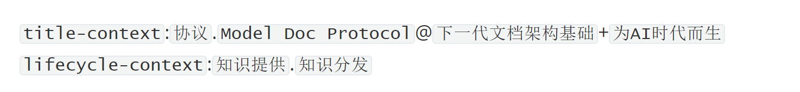

# Context Mark 语言

> **Note**
> The English version will be released later. 欢迎查看本项目的中文文档。

<br/>

Context Mark Language（简称CML），面向AI时代的上下文标记需要，提供符合自然语义的全新标记架构。

Context Mark Language标记语法的核心特征，是用**单字符串**表示多维度、可组合、隐含上下文关系的语义性标记结构，提供更简单的编写、嵌入、传输、存储、运算体验。

## 版本

当前语言规范为 **v1.0**，待发布状态。详细规范可以在 [spec1.0/zh.md](spec1.0/zh.md) 中查看。

## License

项目临时采用双许可机制，未来将采用Apache 2.0 License，详见 [LICENSE.md](LICENSE.md) 

## 论文

CML阐释了“Token即语义维度，分隔符即语义逻辑”的Context Structure Expression模型。该表达模型有望成为AI时代语义标记的新基石。论文详见：

* 英文版本：[CSE:A Unified Framework for Semantic Contextual Annotation.md](./paper/CSE.md)
* 中文版本：[CSE模型：上下文语义标记的统一框架.md](./paper/CSE_zh.md)

## 设计目标

Context Mark Language最初是伴随Model Doc Protocol（MDP-模型文档协议）而生，旨在提供一种接近自然语言表达的、可自由定义、任意嵌入的上下文语义结构基础架构。

AI可能需要知识数据源主动提供上下文。

但**不需要**类似下面这样**伪精确**、**不便存储传输**的标记：

```json
{
    "original-text":"这是关于MDP协议的知识点原文,知识提供者向LLM主动声明了建议加权的上下文标记......",
    "title-context":[
        {
          "token":"协议",
          "weight":0.3,
          "object_token":[{
              "token":"Model Doc Protocol",
              "weight":0.9,
              "property-token":{
                  "token":"下一代文档架构基础",
          		  "weight":0.2,
              }
          }]
        },
        {
          "token":"为AI时代而生",
          "weight":0.4,
        },
    ],
     "lifecycle-context":[
         {
          "token":"知识提供",
          "weight":0.1,
         },
         {
          "token":"知识分发",
          "weight":0.1,
         },
     ]
}
```

AI时代，知识数据源真正需要的只是**语义化**的标记结构，且最好是**自然语言表达**、**易于存储和传输**、**可运算**。

而借助CML，我们只需要书写一串语义化的单一字符串，即可极简的表达上述复杂的上下文结构，且天然可运算：

```markdown
`title-context`:`协议`.`Model Doc Protocol`@`下一代文档架构基础`+`为AI时代而生` `lifecycle-context`:`知识提供`.`知识分发`
```

这个CML字符串本身就是一个合法的markdown格式，因此可以在任意支持Markdown的主流编辑器中被实时渲染成下面的自然语义效果，一目了然：



而经过base58编码之后的CML字符串，几乎可以被安全用于任何嵌入、存储、传输场景，在包括但不限于`html标签`、`模版字符串`、 `JSON`、`URL`、`数据库存储`、`序列化编码`、`日志输出`、`配置文件`、`shell/命令行`、`正则表达式`等所有主流场景下，**免除转义、格式错乱的困扰**。
