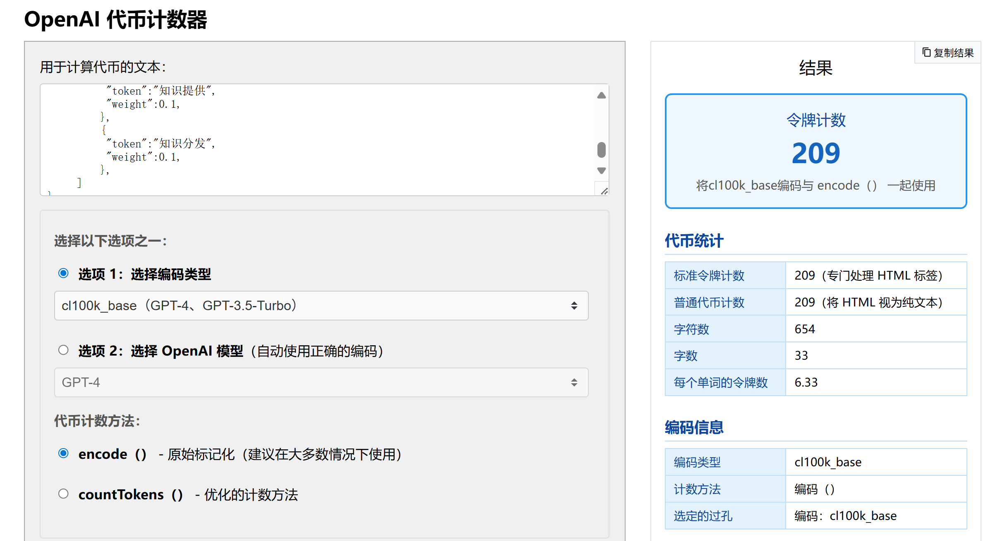

# Context Mark 语言

<br/>

Context Mark Language（简称CML），面向AI时代的上下文标记需要，提供符合自然语义的全新标记架构。

Context Mark Language标记语法的核心特征，是用**单字符串**表示多维度、可组合、隐含上下文关系的语义性标记结构，提供更简单的编写、嵌入、传输、存储、运算、命名体验。

<br/>

​                                                                  [中文文档](https://doc-war.com/CML) | [English document](https://doc-war.com/contextmarklanguage)

<br/>

## 版本

当前语言规范为 **v1.0**-beta.1，预发布状态。详细规范可以在 [spec1.0/zh.md](spec1.0/zh.md) 中查看。

## License

项目临时采用双许可机制，未来将采用Apache 2.0 License，详见 [LICENSE.md](LICENSE.md) 

## 论文

CML阐释了Context Structure Expression模型。该表达模型有望成为AI时代语义标记的新基石。论文详见：

* DOI [10.5281/zenodo.15255534](https://doi.org/10.5281/zenodo.15255534). 

* 英文版本：[CSE:A Unified Modeling Framework for Semantic Contextual Markup.md](./paper/CSE.md)
* 中文版本：[CSE模型：上下文语义标记的统一建模框架.md](./paper/CSE_zh.md)

## 设计目标

Context Mark Language最初是伴随Model Doc Protocol（MDP-模型文档协议）而生，旨在提供一种接近自然语言表达的、可自由定义、任意嵌入的上下文语义结构基础架构。

### 为语义时代而生

未来`可解释性`、`可追溯性`、`可组合性`的知识治理架构蓝图里，需要知识数据源主动提供一部分显式上下文，而不是全部隐式冻结在LLM的权重黑箱里，或者RAG的向量黑箱里。

但不需要类似下面这样**伪精确**、**不便存储传输**的静态标记：

```json
{
    "original-text":"这是关于MDP协议的知识点原文,知识提供者向LLM主动声明了建议加权的上下文标记......",
    "title-context":[
        {
          "token":"协议",
          "weight":0.3,
          "object_token":[{
              "token":"Model Doc Protocol",
              "weight":0.9,
              "property-token":{
                  "token":"下一代文档架构基础",
          		  "weight":0.2,
              }
          }]
        },
        {
          "token":"为AI时代而生",
          "weight":0.4,
        },
    ],
     "lifecycle-context":[
         {
          "token":"知识提供",
          "weight":0.1,
         },
         {
          "token":"知识分发",
          "weight":0.1,
         },
     ]
}
```

LLM时代，知识数据源真正需要的只是**语义化**的标记结构，是语义关系本身，且最好是**自然语言表达**、**易于存储和传输**、**可运算**。

而借助CML，我们只需要书写一串语义化的单一字符串，即可极简的表达上述复杂的上下文结构，且天然可组合运算：

```markdown
`title-context`:`协议`.`Model Doc Protocol`@`下一代文档架构基础`+`为AI时代而生` `lifecycle-context`:`知识提供`.`知识分发`
```

这个明文CML字符串本身就是一个合法的markdown格式，因此可以在任意支持Markdown的主流编辑器中被实时渲染成下面的自然语义效果，一目了然：

`title-context`:`协议`.`Model Doc Protocol`@`下一代文档架构基础`+`为AI时代而生` `lifecycle-context`:`知识提供`.`知识分发`

### 熵减率

CML的其中一个设计目标是接近香农极限，无论信息表达维度还是语义表达维度，实现最低的成本。

示例JSON表达权重语义，使用了711个字符（209个token），而CML字符串只需要122个字符（13个token）。信息容量提升了580%，token稀松率高达94%，很显然，在大规模token计算场景，CML可以在存储、内存、CPU层面带来成本的量级下降。



### 编码

CML的另一个设计目标是安全和性能。

CML支持4种编码模式，确保无论在大规模场景还是短串场景，都具有最高的适应性。

其中经过Base58编码和首位模式字母附加之后的字符串，几乎可以被安全用于任何`嵌入`、`嵌套`、`存储`、`传输`、`命名`场景。包括但不限于，在html标签、模版字符串、 JSON、URL、数据库存储、序列化编码、日志输出、配置文件、shell/命令行、正则表达式、key命名、变量命名等所有主流场景下，**免除转义、格式错乱的困扰**。

比如：

在html中使用`alt`、`data-cml`来承载图片语义，方便LLM、搜索引擎低成本识别。

```html

```

在json的key位置使用cml编码字符串

```json
{	
    "a3EkzyE8r5SqnU6KSbLS98LVLJxFoNvskzaazkuEEryWminqaGwJz13YoatvfoRWoDyrofwUCQ":"key是本图片url的上下文标记",
 	"name":"doc-war",
    "semantic":"文档战争",
}
```

在模板字符串中原文出现，或者在自然语言上下文中出现

```js
const knowledge = "这是知识原文，我们用CML格式，给他提供了一些上下文标记"
const text = `这是知识点${Knowledge}一个CML字符串：a3EkzyE8r5SqnU6KSbLS98LVLJxFoNvskzaazkuEEryWminqaGwJz13YoatvfoRWoDyrofwUCQ`;
```

安全拼接出sql语句

```mysql
SELECT * FROM `knowledge_mark` WHERE `tokens` = 'a3EkzyE8r5SqnU6KSbLS98LVLJxFoNvskzaazkuEEryWminqaGwJz13YoatvfoRWoDyrofwUCQ';
```
