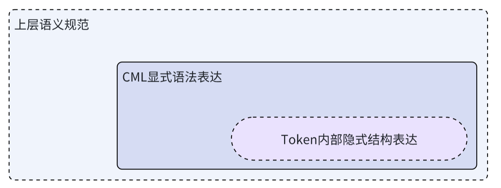

# 隐式表达和约束

CML采用了最少的完备语法结构，5种语义结构语法的自由组合，可以应对95%的语义场景。

那剩下的5%呢？

## 结构表达架构

CML也不需要万能！

CML提供的是一种标准语义架构，其本身是更大的结构表达架构的一部分。

## 隐式结构表达

在CML中充当结构基元的语义Token，不一定是基本关键字，如果Token本身隐含内部语义结构，则由LLM为代表的上层平台或工具负责解析。

比如区间关系、依赖关系，是可以借助语义Token本身的内部语义来支持。

区间更多偏值语义的关系结构。比如`18岁~32岁`，可以作为一个语义Token来标记，而非标记成`年龄`:`18`~`32`的多Token结构，这正是CML不提供类似`~`的更多关系分割符的原因。

依赖关系CML也没有支持，可以通过在Token内部命名修饰来解决

* `签证.依赖资料` :`护照`
* `孩子上学.依赖条件` :`户口所在地`

类似这样的自然语义结构是隐式存在的，只要构造语义Token时能遵循通行的自然语义，最终隐式语义完全可以留给LLM来解析。

## 上层规范约束

在语义结构的表达上，CML充当是**语法层协议**，只提供灵活的架构能力，结构语义，而不关心具体的语义内容。更规范的语义内容和标准化命名和结构约定，留给上层的**语义层协议**。