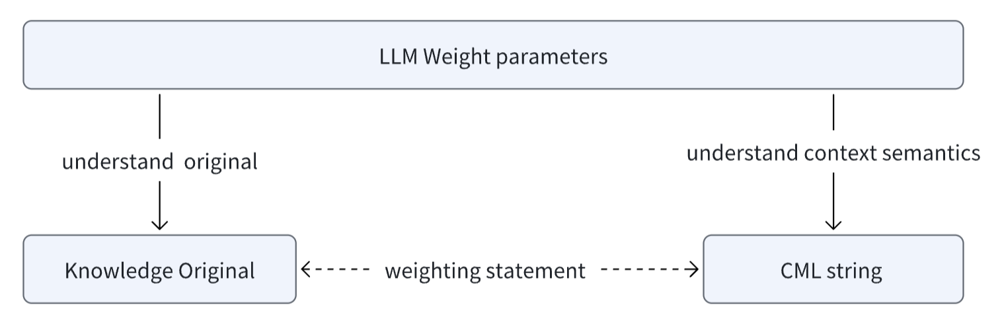
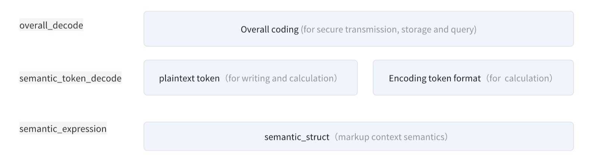
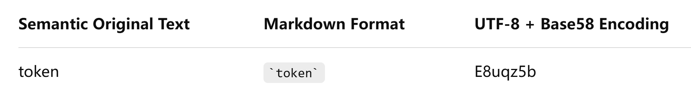
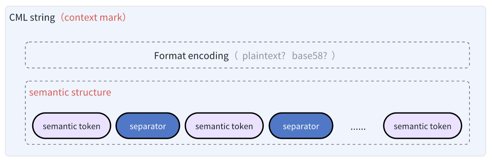

# Contextual Structure Expression: A Unified Modeling Framework for Semantic Contextual Markup


## Abstract

With the development of large language models (LLMs), knowledge has gradually replaced information as the core object of processing, and the focus of structured expression is quietly shifting.


Traditional structured expressions, represented by JSON, YAML, RDF, etc., are limited by static structures and deterministic assumptions, making them difficult to meet the needs of a semantics-driven era. In intelligent systems, the actual semantics often depend on changes in contextual background. The preset schema approach becomes extremely rigid when dealing with dynamically changing contexts. Moreover, because LLMs are better at processing natural language, using JSON, YAML, or RDF to exchange semantics leads to frequent conversions between these formats and natural language. During the linearization process, a certain degree of semantic loss occurs, ultimately leading to contextual inconsistencies and various issues in multimodal collaboration, dynamic context binding, and explainability.


This is fundamentally a generational disparity issue, as these formats were created for information exchange rather than for expressing semantic relationships.


To address this, this paper proposes a minimalist expression paradigm for semantic modeling — Contextual Structure Expression (CSE), and based on this paradigm, designs Context Mark Language (CML), which prioritizes semantic structure expression and can be embedded within natural language. It demonstrates significant advantages in the marking, transmission, storage, sharing, and computation of context, showing vast potential in the standardization and generalization of semantic relationship expression.


## 1.Introduction

In recent years, large language models (LLMs) have achieved groundbreaking progress in natural language understanding and generation.


### Background

With the widespread adoption of generative AI and large language models (LLMs), natural language processing is entering a new phase—one that relies more heavily on semantic structures and contextual reasoning.


However, current research and applications of LLMs are still primarily focused on knowledge lifecycle management, including processes such as knowledge acquisition, representation, reasoning, and generation. In existing systems, contextual semantics are typically treated as unstructured and ephemeral inputs. There is still a lack of systematic modeling paradigms and intermediary protocols, making this a key bottleneck in the advancement of LLM-driven intelligence.


### The Paradigm Problem

The paradigms for semantic representation and semantic storage are among the most pressing challenges facing the industry today.


On one hand, most mainstream AI models still rely heavily on offline training to acquire knowledge. This approach embeds knowledge directly into model parameters, resulting in poor consistency and making it difficult to support high-frequency updates to knowledge versions. Once distilled into the model, knowledge becomes internal weight parameters—effectively “frozen semantics.” These cannot be modified, recombined, or interpreted, making it extremely difficult for external systems to manage knowledge flexibly at the contextual level. This structural limitation leads to a high cost for knowledge iteration, which is particularly detrimental for regulatory documents and time-sensitive professional knowledge, causing slow updates [1] and significant lag.


Although the widely adopted RAG (Retrieval-Augmented Generation) framework enables dynamic knowledge injection to some extent [2], in essence, it only shifts the problem of “freezing” from inside the model to an external retrieval database. The form changes—from model parameters to vector fragments—but the fundamental issue remains unresolved.


On the other hand, existing semantic representation formats such as RDF and JSON-LD [3] do offer structural precision, but they fall short in terms of lightweight flexibility. Their annotation formats are quite distant from the natural language form that LLMs are designed to work with, which creates significant limitations in embedding, transmission, storage, multimodal sharing, compositional operations, and linear transformations.


Moreover, these formats generally emphasize static structures and explicitly annotated numerical weights. Static structures impose semantic constraints through predefined schemas, but due to differences in expression standards across modalities and models, they inherently lack general-purpose, cross-modal, and cross-model alignment capabilities [4]. Meanwhile, explicit numerical weights struggle to accurately represent the implicit relationships, semantic ambiguity, and dynamic intent present in natural language dialogues and tasks—it's a kind of "false precision".


A more promising direction is to achieve a decoupling of semantic structure representation and weight quantification at the architectural level. This would allow contextual semantic structures to be managed independently, and even upstream at the knowledge source—retaining the original context during the storage phase, and combining it dynamically with the runtime context (or different context-aware algorithms) for on-the-fly reasoning and weight computation.


In such a framework, semantic structures can evolve independently [5], without being constrained by any specific model or modality’s weighting strategy—thus enabling a pluggable, evolvable, reusable, and interpretable system for semantic modeling.


## A New Paradigm for Semantic Expression: CSE

To meet the emerging demands of semantic structure modeling in the era of LLMs, CML (Context Mark Language) introduces a novel contextual semantic expression model called Contextual Structure Expression paradigm(CSE).


CSE adopts a linear composition format of “semantic tokens + relational delimiters”, representing multi-dimensional semantic information and its weight structure using a  natural language-compatible string. This approach—based on a single string, encoding only semantic structure, and supporting compositional operations—offers clear advantages over traditional static, structured annotation languages:

* Lightweight for storage and embedding, enabling seamless integration with a wide variety of frameworks and formats.

- Model-agnostic and modality-neutral, independent of any specific quantization strategy, making it a universal semantic intermediary format for sharing context across multi-agent, multi-model, and multi-modal systems.
- Human-readable, embodying a “what-you-see-is-the-semantic” property that naturally supports interpretability, semantic restoration and reconstruction, traceability, and human-AI collaboration.
- Ability to freely combine operations, empowering dynamic reasoning chains and task decomposition with flexible recombination and semantic orchestration.


These advantages make it possible for CSE to become the "Context Interlingua" of the AI era and play an infrastructural role in future evolution.


## Structure of This Paper

The main content of this paper is organized as follows:

1. An exposition on semantic loss and generational gaps in statically structured languages;

2. An analysis of semantic freezing caused by the coupling of logical architectures;

3. the Contextual Structure Expression (CSE) design;

4. the Context Mark Language (CML) specification;

5. A comparative analysis between CML and mainstream expression formats;

6. Conclusion and future prospects

7. References involved or recommended in this paper.


## 2.Related Solutions and Limitations

Currently, within the LLM ecosystem, statically structured languages (such as JSON, YAML, RDF) continue to play important roles in several key stages:

* Data Ingestion [6]: Used to represent structured knowledge such as user profiles, knowledge graphs, and API configurations, embedded into model input through prompt templates;

* Training Data Construction [7]: Serve as a mechanism for generating supervised corpora and aligning structured semantics (e.g., semantic triples);

* Inference and Task Execution [8]: Structured data is re-serialized into natural language prompts to support complex tasks such as RAG and multimodal question answering.


However, such value is primarily of engineering significance, rather than semantics-centered value.


### Expression Paradigm Issues

Challenges at the Semantic Expression Layer.


While the current LLM industry primarily focuses on the knowledge lifecycle—that is, how to ingest, train, infer, and update—static structured languages such as JSON, YAML, and RDF have indeed proven sufficient for engineering systems. However, when the focus shifts to the semantic lifecycle—including how to annotate, transmit, store, manage, compute dynamically, perform semantic reasoning, and align across modalities [9]—these engineering-driven solutions reveal significant limitations.

| Dimension        | Characteristics                                              | Impact                                                       |
| ---------------- | ------------------------------------------------------------ | ------------------------------------------------------------ |
| Static Structure | Relies on predefined schemas and nested hierarchies, with semantic binding constrained by fixed field names and structural levels. | Fails to provide cross-platform consistency and struggles to support LLM dynamic task modeling. |
| Semantic Loss    | Lacks mechanisms for expressing temporal order, intention hierarchy, or logical progression—It is not conducive to LLM alignment, especially in complex scenes. | The process of linearizing structured semantics into prompts and embedding them into rigid formats is essentially a "downgrade-style" bridge, inevitably causing semantic compression and contextual distortion. |

The original intent of statically structured languages is information exchange and storage, not complex semantic modeling or dynamic reasoning.


Although LLMs can 'understand' JSON and YAML, there is a significant morphological gap between these formats and natural language. The transformation process of natural language ⇋ structured formats ⇋ natural language inevitably incurs semantic loss, making such approaches inadequate—and certainly not optimal—as a mode of semantic representation.


Fundamentally, this reflects the problem brought about by intergenerational differences in paradigms: what the industry truly needs is a semantic interface, not merely a data interface.


### Semantic Freezing Problem

Challenges at the Semantic Storage Layer.


As mentioned in the introduction, LLMs heavily rely on offline training paradigms, leading to semantics being frozen within model parameters in the form of weights. This makes it difficult for external systems to manage semantic context flexibly and cost-effectively. As a result, knowledge updates essentially equate to retraining the model—a costly endeavor that ultimately manifests as slow knowledge updates on the user side.


On one hand, due to the tight coupling between weight parameters and model structures (e.g., number of layers, attention mechanisms), the original semantic structure is irreversibly compressed during training and frozen into the model’s architecture. This makes semantics hard to reuse or port across platforms.


On the other hand, the quality of these “frozen” semantic representations depends heavily on the algorithms, training data, and the quality of the original knowledge during the training stage. However, because the original semantic structure is lost, it is impossible at runtime to leverage new algorithms, updated corpora, or refined semantic annotations for low-cost correction. Even if a knowledge source provides higher-quality semantic labels, the model is unable to dynamically integrate them.


While RAG seemingly provides LLMs with dynamic access capability, it does not fundamentally solve the update timeliness required by users (e.g., second-level and minute-level updates).


This is not merely an engineering challenge—it stems from structural limitations in the Transformer architecture's approach to semantic representation and storage. A more promising direction lies in decoupling semantic structure expression from weight quantization at the architectural level.

* Treat the semantic structure as a universal intermediate representation, independent of model parameters and externalized from the model itself.

* This intermediate representation is conceptually similar to the role of ONNX in serving as a universal exchange format for neural networks [10], but instead of computational graphs, it focuses on representing semantic relationships, intended for explicit storage of original contextual semantics.


Once decoupled:

* Semantics can be extracted from the model architecture and treated as platform-independent formatted data, enabling uniform parsing and processing across different model types and modalities.

* Semantics can evolve independently of the original knowledge text. External systems will be able to directly read, edit, or extend them—enabling the concept of Semantic-as-a-Service.

* Model weights would no longer be the sole carrier of knowledge. If both training and inference are centered around general semantic structures, it opens the door to a new class of LLM architectures that only interpret semantic expressions rather than bear the full burden of knowledge retention. From a knowledge perspective, this significantly lowers the cost of updates and increases reusability and flexibility. From an AI engineering standpoint, it also brings stronger controllability, explainability [11][19], and algorithmic adaptability.


### Direction

To conclude, the AI era may call for a native semantic interlingua (Context Interlingua)—a foundational layer of infrastructure for the future of intelligent systems. This is a role that traditional static structural languages such as JSON, YAML, and RDF were never designed to fulfill, nor are they capable of evolving into.


In the following sections, we introduce the proposed paradigm of Contextual Structure Expression (CSE) for dynamic semantic modeling, along with its concrete implementation: the Context Mark Language (CML). We then explore the broader prospects of these innovations in driving the standardization and generalization of semantic expression in the age of LLMs.


## 3. CSE Expression Paradigm Design

**Contextual Structure Expression (CSE)** is a paradigm centered on **contextual dimensions**, presenting a fundamentally different approach in terms of semantic architecture, expression form, and structural representation.

### Let’s Start with Examples

| Expression                                   | Semantic Interpretation                                      |
| -------------------------------------------- | ------------------------------------------------------------ |
| `message`:`urgent`+`alert`@`user123`         | A message with the nature of “urgent” and “alert,” targeted at user123 |
| `task`.`create`:`document`@`project`.`alpha` | A task to create a document within project alpha             |
| `question`.`ai`.`model`+`language`           | A compound question about AI, models, and language           |
| `error`.`timeout`.`network`@`device`         | A network-related error of type “timeout” occurring on a device |

The above are representative examples of CML (Context Mark Language) plaintext semantic formats. They are highly human-readable, close to natural language, and friendly to semantic parsing, structural reconstruction, reasoning path tracing, indexing, and interpretability.


As seen from the CML examples, one of the core design goals of CSE is to enable concise, flexible, and intuitive expression of semantically rich contextual structures.


### Linear Structure

CSE adopts a single-string linear text format that is compatible with natural language, serving as the carrier for semantic structural expression. The primary motivation behind this choice is to avoid semantic loss caused by repeated transformations between natural language ⇋ structured format ⇋ natural language.


### Primitive Architecture

The semantic string in the CSE paradigm is composed of a sequence of semantic primitives, which include two types: semantic tokens and relation separators.

* Semantic Tokens are the fundamental units for describing contextual semantics. They can be any word or short phrase in textual form. While conceptually analogous to "tokens" in the LLM domain, they are not lexical in nature but represent abstract semantic dimensions that carry natural meaning.

* Relation Separators are symbolic delimiters used to represent semantic relationships between tokens, implicitly indicating priority  weight in their connections. These separators—such as @, ., :, +, and space—are statically defined, with explicit hierarchical semantics and structural roles.


### Semantic Expression Rules

We use `<semantic_token>`to denote a semantic token, and `<separator>` to denote a relation separator. The expression rules are defined as follows:

* Each semantic token (`<semantic_token>`) must be connected to another using one and only one relation separator (`<separator>`).

* Semantic tokens and relation separators must appear in alternating order, following the pattern:`<semantic_token><separator><semantic_token><separator>...<semantic_token>`


### Fuzzy Semantics

The **CSE paradigm** deliberately avoids expressing explicit numerical weights. Instead, it focuses solely on encoding **the original semantic structure**, using the intrinsic semantics of **tokens** and **structural composition** to implicitly convey weighting cues and prioritization to LLMs. These implicit signals may then indirectly influence weight computation during inference.

- Each **semantic token** encapsulates **multiple potential meanings**.
- Each **relation separator** is defined with **one or more semantic relationship types**.
- A single relation separator may represent **multiple relationship semantics**. If the exact weighting priority cannot be directly inferred from the separator, the LLM can **indirectly reason** about the actual semantic relationship and its relative importance based on the context provided by the surrounding semantic tokens.


This **tolerance for ambiguity** introduces a critical feature: **adaptive contextual dynamics** [12]. It enables semantic contexts to be **stored independently** or **distributed across systems**, and dynamically **composed and weighted** at runtime based on real-time contextual conditions—or even under varying reasoning algorithms.



From the perspective of knowledge governance architecture, the **CSE paradigm advocates a “separation of powers”** among **original knowledge content**, **contextual annotations**, and **LLM weights**, rather than distilling all semantic and knowledge content entirely into the model’s weight parameters.


### Format Encoding

On top of freely composable semantic expressions, formalized encoding is applied to produce the final contextual semantic markup.

* The plaintext format is designed for human readability, compatible with Markdown syntax, and easy to write.

* At the same time, an encoded format is supported to eliminate delimiter ambiguity and special character issues, effectively avoiding the hassle of escaping and format corruption [13]. Since strings are the primitive value type across all mainstream data formats, CSE expressions can seamlessly integrate with existing frameworks, formats, and syntaxes. With simple encoding, they can be safely used in any embedding, nesting, storage, or transmission scenario—including but not limited to JSON, YAML, HTML, SQL, URLs, regular expressions, and shell commands.





### Semantic Structure

Relation separators (`<separator>`) are responsible not only for connecting semantic tokens in the expression form, but also for carrying the semantic meaning of the structure itself.


The design of relation separators is one of the core challenges in the CSE paradigm. It involves a **minimal completeness conjecture** centered on "**relation-first semantic expression**" [14] — specifically, what primitive structures to adopt, what types of relational semantics to represent, and how to assign precedence among them.


This area intentionally leaves **design space** open for markup languages, and CML is not necessarily the optimal solution.


## 4. CML Language Specification

CML (Context Mark Language), as the concrete implementation of the CSE paradigm, builds upon the semantic architecture and expression forms described above. It further specifies the scope of semantic structures, precedence rules, symbol representation, and encoding rules for semantic strings.


### Symbol Representation

In terms of form, CML selects five single-byte symbols that closely align with natural semantics—:, ., @, +, and (space)—to serve as relational separators. It also defines structural semantics and explicit precedence levels for each.


### Semantic Structures

The five relation separators in CML are semantic structural primitives abstracted around three core requirements: priority expression of tokens, structural extensibility, and logical orthogonality. These primitives possess a high degree of expressiveness and combinability, serving as the fundamental building blocks for constructing all forms of logical-semantic relationships.


These five structural primitives are categorized into three types: `basic structures`, `composite structures`, and `compound structures`.


* Basic structures define simple structural relationships among multiple semantic tokens and can also serve as components within composite structures.

* Composite structures are built from multiple basic structures.

* Compound structures, on the other hand, are more macro-level container types that can link together any combination of semantic tokens, basic structures, and composite structures.


#### a. Supplementary Relations

This is a **basic structure**. The semantic object on the right serves as a supplementary explanation, specification, or constraint to the semantic object on the left. Typically, it adds semantic detail without altering the original semantic structure.
$$
f:A∋B∋C
$$
This relationship is represented by the symbol `@`. The further to the left a token appears, the higher its implicit priority—indicating it should carry more semantic weight.


For example:

* `name`@`identity`@`organization`
* `name`@`company`@`position`

The priority weight declarations for these two sets of tags are different, but the focus of both is to emphasize 'name' first


#### b. Linear Progression Relations

This is a **basic structure** representing an ordered, step-by-step semantic relationship. It can describe a wide range of directional flows such as: progression, transformation chains, causal chains, sequences, refinements, and lifecycle stages.
$$
f:A→B→C
$$


The symbol `.` is used to express this relation. Whether the left-hand side carries slightly more semantic weight than the right is context-dependent; the LLM is expected to infer the relative priority based on the actual semantic tokens involved.


Examples:

- `biological`.`animal`.`human` — the emphasis is on `human` as a subclass in this progression.
- `product_design`.`development`.`operations` — based on the tokens themselves, it clearly describes a semantic lifecycle.


#### c. Parallel Set Relations

This is a **basic structure** where multiple semantic elements are presented in parallel—akin to a set, a group of object attributes, or a multi-branch description—with no implied priority or sequence. The elements can be rearranged without altering the meaning.
$$
f:\{A, B, C\}
$$
The  symbol `+` is used to represent this structure, indicating equal weight among the tokens.

Examples:

- `man` + `woman` — relative to the concept of , the combination order doesn't matter.`human`
- `name` + `age` + `username` — all are part of a user’s registration information.


#### d. Mapping Relations

This is a compound correspondence between one semantic structure and another, in a key-value (k-v) format. Both sides can use the basic relationships described above, supporting two-dimensional semantic expression.
$$
f(A,B) ↦ f(C,D,E)
$$
The `:` symbol is used to represent this structure. It is similar to a key-value pair but offers more flexibility in construction. Both the key and value parts can use basic structures, not just primitive semantic tokens.

```text
<key-context-struct>:<value-context-struct>
```


Examples of valid mapping semantic structures:

- `website`: `doc-war.com`
- `website`@`doc-war.com`: `Document Battlefield`@`Contribution Judgement Value`
- `AI`+`LLM`: `ChatGPT`+`Claude`@`v3.7`
- `ask`.`answer`: `Please introduce CML language?`.`CML language is a semantic structure language that aligns with natural semantics`


##### Special Constraints

CML **does not support nested mappings**, in order to avoid increasing the parsing complexity of the semantic structure itself. For example, expressions like `user:ZhangSan:delete+query` are considered invalid in format.


#### e. Combination Relation

Multiple semantic structures combine to form a new semantic whole, without losing their original meaning. Conversely, splitting them also preserves the meaning. Essentially, this is a computable "relation structure container."
$$
f(A)+f(B) =f(A+B)
\\
f(A) =f(A+B) - f(B)
$$

The `space` symbol represents the semantic overlay of any two structures.


"Because the space symbol has the lowest semantic priority, and the order of the two sides (left or right) does not affect priority, it also serves as the overall operator for CML strings. By using a space to naturally concatenate two plaintext CML strings into a new CML string, the result is still a valid CML string that does not alter the original semantic meaning."
$$
plaintext(A)+space+plaintext(B) = plaintext(A+space+B)
$$

This **lossless restoration** characteristic of freely splitting and rejoining CML strings endows them with semantic operability, not merely serving as a semantic expression. It provides a solid foundation for collaborative work in tagging.


##### Special Constraint

Since `space` serves the role of a lossless semantic operation, expressions like `if user:ZhangSan is how` are technically valid in format but will break the principle of lossless combination. When multiple semantic strings are split and recombined, their meaning will be disrupted due to the change in position.


### Operation Priority

Relational operations in CML are similar to the expression parsing in programming languages: lexical scanning is performed from left to right, and then, based on the priority of the relational separators, the order of semantic operations is determined.

CML defines explicit priorities to ensure consistency in semantic interpretation during tagging and inference stages:
$$
Supplementary>LinearProgressive>ParallelSet >Mapping>Combination
$$


### Minimal Completeness

The five relationship separators are abstracted from the semantic structures of natural language and are the result of deep consideration regarding ambiguity in expression and the controllability of structure.


#### Natural Language Reference

The five relational separators defined in CML are inspired by the most fundamental semantic structures implicitly found in natural language: **modification**, **sequential progression**, **parallel listing**, **contrast/mapping**, and **combination**.

```markdown
Examples from natural language:
Example: “The `man`A `tall`B `wearing a hat`C”       (A←B←C)
Example: “He `woke up`A, `got dressed`B, and `went out`C”            (A→B→C)
Example: “I like `apples`A, `bananas`B, and `oranges`C.”       {A, B, C}
Example: “`ChatGPT`A, `Claude`B, and `DeepSeek`C are all `AI`D, also known as `LLM`E”        (A+B+C ↦ D+E)
Example: “`This flower`A + `is beautiful`B = `This flower is beautiful`A+B                              (A+B=AB)
```

Theoretically, by combining these five relational primitives, one can express the vast majority of logical relationships. This gives the system a high degree of completeness.


#### Semantic Within Tokens

For logical relations like exclusion, quantifier ranges, or nested mappings, CML does not support them natively at the structural level. Instead, it delegates them to the **token level**, to be used in conjunction with **supplementary relationships**, avoiding structural pollution and reducing complexity in both precedence operations and human readability.


Because tokens themselves can also express structure.

```markdown
Natural language example: “Age about 18 to 25, and definitely not Chinese.”        (The token itself can imply range or exclusion structures)
Annotation:
❌ `age`:`range`:`18-25`        (Invalid nesting, completely unnecessary—can be merged earlier or later)
❌ `age`:`>18`+`<25`            (Overly fine-grained and unnecessary splitting)
✅ `age`:`range:18-25`         (Nesting within the token aligns with natural semantics)
✅ `age`:`18-25`      

```

This reflects the **principle of structural minimalism**:

The CSE paradigm does not attempt to explicitly resolve all structural semantic ambiguities in advance. Instead, it leverages the semantic tokens connected by relational separators as the context for interpreting relationships, enabling the LLM to infer the most reasonable semantic relationships and corresponding weight priorities.


#### The Core Value of Explicit Structure

Skillfully expressing semantic structure within tokens also highlights CML’s core value in **explicit encoding**.

CML approximates—but is not equal to—natural language. Beyond expressing weighted core semantics, it serves a critical expressive purpose. Unlike natural language reasoning, where token segmentation is uncontrollable, explicit segmentation in CML allows for vertical layering and horizontal relationship delineation in semantics. This eliminates relational ambiguity and ultimately enhances **controllability** and **interpretability**.


### Encoding Rules

Based on semantic expression, CML defines **two standard string formats**. The core difference lies in **which object**, at **what stage**, and **in what form**, wraps the semantic token (`semantic_token`).




#### Natural Language Format

The **natural language format** is designed for documentation engineers to **write in plain text**, suitable for **human-readable scenarios**.

It uses **Markdown syntax** (specifically, *inline code* with backticks) [15] to wrap semantic tokens (`semantic_token`). Documentation engineers can work within a WYSIWYG Markdown editor, making it **fast and intuitive** to edit semantic structures in plain text.

For example, writing the following plain-text string in Markdown:

```markdown
`token1`.`token2`@`token3`+`token4` `token5`:`token6`
```

Will instantly render into the following clear and readable semantic structure:`token1`.`token2`@`token3`+`token4` `token5`:`token6`


#### Encoded Format

CML strings that include backticks (<code>`</code>)—including the separators—may, in certain special scenarios, lead to **unexpected parsing boundaries** or **escaping issues**.

To address this, and to support use cases such as **embedding**, **storage**, **parsing**, and **computation**, CML defines a more **secure and consistent encoded output format**.



Example

```markdown
`token1`.`token2`@`token3`+`token4` `token5`:`token6`
```

To encode the above plain-text CML string into its **encoded format**, follow these steps:

1. Extract semantic tokens and separators From the original CML string, extract all `semantic tokens` (text within backticks) and `relationship separators` (e.g., `.`, `@`, `+`, ` `, `:`).

2. For each semantic token, its original text (excluding the backticks) is first encoded into a byte stream using UTF-8, and then this byte stream is Base58 encoded [16] to generate a Base58 string.

```text
token1 → encoded → zyvFCwFv
token2 → encoded → zyvFCwFw
token3 → encoded → zyvFCwFx
token4 → encoded → zyvFCwFy
token5 → encoded → zyvFCwFz
token6 → encoded → zyvFCwG1
```

3. Next, replace the encoded tokens back into the original string; in other words, Base58 encoding takes over the wrapping function of backticks.

```text
zyvFCwFv.zyvFCwFw@zyvFCwFx+zyvFCwFy zyvFCwFz:zyvFCwG1
```

4. Finally, the entire result is encoded again using UTF-8+Base58, eliminating all special characters.

```text
3EkzyE8r5SqnU6KSbLS98LVLJxFoNvskzaazkuEEryWminqaGwJz13YoatvfoRWoDyrofwUCQ
```


#### Line Breaks and Multi-space Compatibility

In natural text editing scenarios, especially when handling longer contexts, users often insert line breaks (\n, \r\n, \r) to improve readability or add consecutive multiple spaces for visual separation, which is a natural practice.


Therefore, CML editors should support preprocessing robustness by uniformly converting all types of line breaks and excessive spaces into a single space before performing Base58 encoding.


## 5. Comparison Between CML and Other Approaches

Currently, there are no systematic solutions identified in this field that address this issue. As of the date of this paper’s publication, no literature has been found that proposes a paradigm based on **dynamic semantic expression**, nor any papers related to **Context Markup Language (CML)**, or Large Language Model (LLM) governance architectures designed from the perspective of the **semantic lifecycle**, including relevant tools or documentation.


The industry is still dominated by static structural languages such as JSON, YAML, and RDF, or their improved versions, which are used to support semantic expression, storage, and exchange.

#### JSON-LD vs CML

Among them, JSON-LD, which is compatible with JSON, is currently considered one of the most advanced static semantic expression formats, especially in the areas of web semantics and structured data annotation.


On one hand, it utilizes the **schema.org** standardized vocabulary [17] for semantic expression, which is a semantic annotation approach supported by major search engines. On the other hand, by using`<script type="application/ld+json">` , it allows for **embedding a snippet of "machine-readable" structured data** into an HTML page. This data is not rendered by the browser and does not affect the visual appearance or layout of the webpage, thus offering a non-intrusive way of semantic expression.


Here is a typical example in JSON-LD format:

```json
{
  "@context": "https://schema.org",
  "@type": "Article",
  "headline": "A New Paradigm: Redefining Knowledge Discovery",
  "author": {
    "@type": "Person",
    "name": "lilei"
  }
}
```

However, it is important to note that schema.org enumerates over 2,000 terms. Such an extensive static semantic specification imposes excessive demands on manual annotation, which can negatively impact annotation quality. Even professional engineers may find it difficult to quickly master every term and its semantic nuance. In the era of LLMs, this approach appears to be "too heavy".


This is precisely why CML defines only five relation delimiters in a minimalist way — I hope for CML to become the Markdown of semantic annotation, rather than another HTML.


#### JSON Lines vs. CML String

Moreover, the nested structure of JSON-LD is highly complex and inefficient to parse in large-scale annotation scenarios, making it less suitable for mainstream use in the LLM field. In contrast, LLMs tend to prefer an alternative approach—**JSON Lines** [18]—which enables **incremental writing/streaming processing** (line by line). 


JSON Lines is widely used by platforms such as OpenAI, Hugging Face, and FastChat for fine-tuning and training data formats.


This format separates each single-line JSON object with a newline character (`\n` ), allowing each line to be read and parsed independently without loading the entire file at once. 


Here is an example of a  file:`example.jsonl`

```json
{"id": 1, "prompt": "Hello", "response": "Hello, how can I help you?"}
{"id": 2, "prompt": "What is JSONL?", "response": "JSON Lines is a structured text format."}
{"id": 3, "prompt": "Thank you", "response": "You're welcome!"}
```

Compared to JSON, the key innovation of JSON Lines lies in its use of  as a relationship delimiter for composition. This concept is remarkably similar to CML’s use of **space**（` `） as a composition operator. CML strings obviously also support incremental writing/streaming.


However, JSON Lines requires file-based storage and is not ideal for use as an **embedded data format**. Additionally, since each line must be parsed as a full JSON object, the segmentation process incurs a higher computational overhead—especially when dealing with large volumes of data. In contrast, CML's use of **single-string slicing** is significantly more efficient in such contexts.`


## 6. Conclusion and Future Work

The CSE paradigm and the design of CML represent not only a structural innovation in single-string semantic expression, but also a conceptual shift in semantic methodology—offering a fresh perspective on the architectural design of next-generation LLMs and their semantic lifecycle.


Looking ahead, both CSE and CML hold significant value for theoretical research and engineering practice. They have the potential to become foundational elements of semantic infrastructure in the AI era, serving as a **structured semantic intermediate language** across the ecosystem. As the capabilities of large models continue to grow, semantic expression, organization, and reasoning are likely to emerge as core competencies—and key differentiators—of next-generation LLMs.


This paper encourages the industry to pay close attention to the theoretical framework and transformative potential of this paradigm, and calls for more visionary contributors to join the effort of promoting CSE and CML as a **globally accepted standard for semantic expression and collaboration**.


As the author’s first systematic research paper in the open-source domain, this work strives for rigor and structure. However, as an independent researcher, limitations in resources, influence, and interdisciplinary collaboration inevitably lead to areas of imperfection. This paper is a humble starting point, intended to spark broader academic discussion and practical exploration. It is my hope to further refine this semantic paradigm in collaboration with more research teams and industry organizations, and to contribute to the advancement of structured semantics in real-world applications.


Open-source project repository: https://github.com/ContextMark/CML


## 参考文献

[1] B. Thompson, “AI will drive the cost of intelligence to zero? Not so fast,” *Medium*, Nov. 10, 2024. [Online]. Available: https://medium.com/the-generator/ai-will-drive-the-cost-of-intelligence-to-zero-not-so-fast-d90d901baf10. [Accessed:  Apr. 2025].

[2] S. Pandey, "Retrieval-Augmented Generation (RAG): Improving AI's Answer with External Knowledge," *Medium*, Oct. 24, 2024. [Online]. Available: https://medium.com/@santoshpandey987/retrieval-augmented-generation-rag-improving-ais-answer-with-external-knowledge-7961641e9fde. [Accessed: Apr. 2025].

[3] K. Cagle, "JSON-LD rewrites the Semantic Web," *LinkedIn*, Sep. 13, 2017. [Online]. Available: https://www.linkedin.com/pulse/json-ld-rewrites-semantic-web-kurt-cagle. [Accessed:  Apr. 2025].

[4] C. Qian, S. Xing, S. Li, Y. Zhao, and Z. Tu, “DecAlign: Hierarchical Cross-Modal Alignment for Decoupled Multimodal Representation Learning,” *arXiv*, Mar. 14, 2025. [Online]. Available: https://arxiv.org/abs/2503.11892. [Accessed: Apr. 20, 2025].

[5] Wikipedia contributors, “DOGMA,” *Wikipedia, The Free Encyclopedia*, Apr. 20, 2025. [Online]. Available: https://en.wikipedia.org/wiki/DOGMA. [Accessed: Apr. 20, 2025].

[6] S. Pimparkhede et al., “DocCGen: Document-based Controlled Code Generation,” *arXiv*, Jun. 2024. [Online]. Available: https://arxiv.org/abs/2406.11925. [Accessed: Apr. 20, 2025].

[7] N. P. Ding et al., “Knowledge Prompt Chaining for Semantic Modeling,” *arXiv*, Jan. 2025. [Online]. Available: https://arxiv.org/abs/2501.08540. [Accessed: Apr. 20, 2025].

[8] X. Tan et al., “Struct-X: Enhancing Large Language Models Reasoning with Structured Data,” *arXiv*, Jul. 2024. [Online]. Available: https://arxiv.org/abs/2407.12522. [Accessed: Apr. 20, 2025].


[9] Y. Liu et al., “Generative AI-driven Semantic Communication Networks,” *arXiv*, Jan. 2024. [Online]. Available: https://arxiv.org/abs/2401.00124. [Accessed: Apr. 20, 2025].

[10] “Open Neural Network Exchange (ONNX),” *ONNX.ai*, [Online]. Available: https://onnx.ai. [Accessed: Apr. 20, 2025].

[11] Anthropic, “Interpretability Dreams,” *Anthropic*, May 24, 2023. [Online]. Available: https://www.anthropic.com/research/interpretability-dreams. [Accessed: Apr. 20, 2025].

[12] Z. Li, Y. Wang, and H. Chen, “Dynamic Skill Adaptation for Large Language Models,” *arXiv*, Dec. 2024. [Online]. Available: https://arxiv.org/abs/2412.19361. [Accessed: Apr. 20, 2025].

[13] “Escape character,” *Wikipedia*, Apr. 2025. [Online]. Available: https://en.wikipedia.org/wiki/Escape_character. [Accessed: Apr. 20, 2025].

[14] S. Jauhar, “A Relation-Centric View of Semantic Representation Learning,” *Ph.D. dissertation*, Carnegie Mellon University, 2017. [Online]. Available: https://www.cs.cmu.edu/~sjauhar/thesis.pdf. [Accessed: Apr. 20, 2025].

[15] “Markdown,” *Wikipedia*, Apr. 2024. [Online]. Available: https://zh.wikipedia.org/wiki/Markdown. [Accessed: Apr. 2025].

[16] “Base58,” *Wikipedia*, Jan. 2025. [Online]. Available: https://zh.wikipedia.org/wiki/Base58. [Accessed: Apr. 2025].

[17] “Schema.org,” *Wikipedia*, Apr. 2025. [Online]. Available: https://en.wikipedia.org/wiki/Schema.org. [Accessed: Apr. 2025].

[18] “JSON Lines,” *Wikipedia*, Mar. 2025. [Online]. Available: https://en.wikipedia.org/wiki/JSON_streaming#JSONL. [Accessed: Apr. 2025].

[19] C. Singh, J. P. Inala, M. Galley, R. Caruana, and J. Gao, “Rethinking Interpretability in the Era of Large Language Models,” *arXiv preprint*, Jan. 30, 2024. [Online]. Available: https://arxiv.org/abs/2402.01761. [Accessed: Apr. 2025].

#### 特别附注

In terms of semantic paradigm thinking, the most cutting-edge conceptual framework may come from Niu Kai and colleagues from Beijing University of Posts and Telecommunications, China, in 2022. Their work aims to advance the way of thinking about communication systems from the "syntactic layer" of the traditional Shannon paradigm to the "semantic layer", shifting the focus from "data compression" to "semantic compression". Based on this foundational logic, they further proposed a corresponding mathematical theory.

[20] K. Niu and P. Zhang, “A Mathematical Theory of Semantic Communication: Overview,” *arXiv preprint*, Jan. 25, 2024. [Online]. Available: https://arxiv.org/abs/2401.14160. [Accessed: Apr. 2025].

[21] K. Niu, J. Dai, S. Yao, S. Wang, Z. Si, X. Qin, and P. Zhang, “Towards Semantic Communications: A Paradigm Shift,” *arXiv preprint*, Mar. 13, 2022. [Online]. Available: https://arxiv.org/abs/2203.06692. [Accessed: Apr. 2025].

In the field of meta-linguistic structural research related to natural language, Professor Cui Xiliang from Beijing Language and Culture University presented some cognitive models in his article published in Issue 5 of *Language Teaching and Linguistic Studies* in 2002. However, these models focus on the **logical dimension** rather than the **underlying structural dimension**.

[22] X. C. Cui, “认知语言学: 研究范围和研究方法,” *语言教学与研究*, no. 5, pp. 1–7, 2002. [Online]. Available: https://fls.blcu.edu.cn/attach/0/1410161054566649318.pdf. [Accessed: Apr. 2025].

