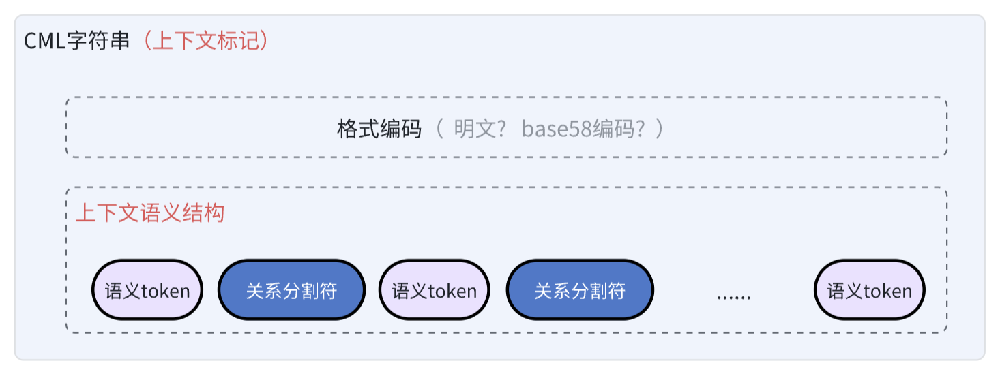

# Context Mark Language规范

**协议版本**：1.0

Context Mark Language（简称CML），面向AI时代的上下文标记需要，提供符合自然语义的标记语法。

Context Mark Language标记语法的核心特征，是用`单字符串`表示`多维度`、`可组合`、`隐含上下文关系`的语义性标记结构，提供更简单的`嵌入`、`存储`、`传输`体验。


## 一、语义架构

Context Mark Language能极简的表达语义化的上下文结构。

用于标记知识上下文的CML字符串，是由一系列的`语义Token`+`关系分割符`两个`语义基元`类型构成。

* **语义Token**，是CML描述上下文语义的基本单位，可以是任意形式的文本片段，对应LLM领域的Token概念，但不是词法性的，而是承载了自然语义的抽象维度。
* **关系分隔符**（`:`、`.`、`@`、`+`、`空格`）用于表达这些语义Token之间的上下文结构关系的语义，隐式声明加权分配的优先级。

在语义基元自由组合的基础上，进行编码，就构成了最终的CML字符串



CML字符串用于标记知识的上下文背景，最终向LLM等知识训练、分发平台提供上下文语义和加权声明，因此也称为上下文标记。


#### 表达规则

CML采用线性结构来描述语义关系（易于嵌入）。

假设我们用 `<semantic_token>` 来表示语义Token，`<separator>` 来表示关系分隔符。那么，规则大致可以这样定义：

1. 每个 **语义Token**（`<semantic_token>`）必须通过有且只有一个 **关系分隔符**（`<separator>`）相互连接。
2. 语义Token和关系分隔符总是交替出现，`<semantic_token><separator><semantic_token><separator>......<semantic_token>`。

#### 举例

`title-context`:`协议`.`Model Doc Protocol`@`下一代文档架构基础`+`为AI时代而生`  `lifecycle-context`:`知识提供`.`知识分发`

以上是一个典型的CML字符串示例，其中的语义Token：

* title-context
* 协议
* Model Doc Protocol
* 下一代文档架构基础
* 为AI而生
*  lifecycle-context
* 知识提供
* 知识分发

而用于分割和组织语义结构的依次用到了`冒号`、`点号`、`@符号`、`加号`、`空格`......

#### 关系运算优先级

关系分隔符遵循明确的运算优先级：

| 关系分割符 | 类型     | 优先级    | 结构语义                                     |
| ---------- | -------- | --------- | -------------------------------------------- |
| `@符号`    | 基本结构 | 最高（1） | 权重降级结构：注释、补充......               |
| `点号.`    | 基本结构 | 次高（2） | 权重递进结构：具体指向、类型嵌套......       |
| `加号+`    | 基本结构 | 再次（3） | 平级组合结构：集合、对象属性集......         |
| `冒号:`    | 复合结构 | 次低（4） | k-v结构：映射                                |
| `空格`     | 组合结构 | 最低（5） | 多k-v结构的平级组合，及CML字符串的整体连接符 |


## 二、语义结构

Context Mark Language能灵活的组织语义结构。

#### 1、显式结构

显式的通用语义结构，由CML语法负责表达。

分`基本结构`和`复合结构`、`组合结构`三大类，基本结构描述多个基元语义Token之间的简单结构关系，同时可作为复合结构的组成单元，而组合结构是更宏观的容器类型，可以连接任意基元语义Token、基本结构和复合结构。

##### <span style="color:red">[基本结构]</span>注解关系

用符号`@`表达元信息修饰之类的降级语义。

```text
name@identity@organization
```

其结构语义，相当于嵌套的对象属性链，后面是对前面的侧面细节补充（类型、限制、生命周期......），越靠前优先级越高，表示权重应该更高。

比如

* `姓名`@`身份`@`组织`

* `姓名`@`公司`@`职位`

两组标记的权重优先级声明是不同的，都重点都是先强调姓名。

##### <span style="color:red">[基本结构]</span>线性关系

用符号`.`表达线性递进语义。

```text
tag1.tag2  
```

其结构语义，相当于顺序递进的类型链或线性轨迹，如果是类型链，则正常越靠后类型越具体，一般权重略高，如果单纯表达整体的线性顺序，则权重并无差异。LLM可以结合语义token本身来最终判断权重优先级。

比如

* `生物`.`动物`.`人`，重点落在`人`这个子类上。

* `产品设计`.`开发`.`运营`，结合语义token本身，可以很清楚的判定他描述了一个生命周期语义。

##### <span style="color:red">[基本结构]</span>集合关系

用符号`+`表达平级选项组合。

```text
tag1+tag2
```

其结构语义，相当于同一个对象下的属性集，用于多属性、多角度、多分支语义描述，权重不分主次先后。

比如

* `男人`+`女人`，相对`人`这个概念，正反组合都一样。
* `姓名`+`年龄`+`username`，都是某个账号的注册信息

##### <span style="color:blue">[复合结构]</span>k-v结构

用符号`:`表示映射关系语义。

```text
<key-context>:<value-context>
```

其结构语义，语义类似于键值对，表达赋值语义，但构造更自由，无论是key还是value部分，都可以使用基本结构，而不仅仅是基元语义token。

比如下面都是合法的kv结构

* `网站`:`doc-war.com`
* `网站`:`文档战场`.`doc-war.com`@`贡献判断力价值`

* `网站`@`中国`:`文档战场`.`doc-war.com`@`贡献判断力价值`
* `lifecycle`@`Knowledge`:`provide`.`Crawling`@`this`.`distribution`
* `AI`+`LLM`:`ChatGPT`+`Claude`@`v3.7`
* `ask`.`answer`: `请介绍CML语言?`.`CML语言是符合自然语义的语义结构语言`

##### <span style="color:green">[连接运算符]</span>结构组合

用`空格`表示对任一结构的组合。

```text
<context-struct1> <context-struct2>
```

其结构语义，类似加号`+`的平级权重声明，但针对的不是语义token基元，而是语义结构的组合。

比如下面的组合都是合法的

* `page@id` `title-context`:`h1`.`h3`.`h5` 
* `doc-context`:`site`.`topic`.`page` `title-context`:`h1`.`h3`.`h5`

#### 2、语义运算

`空格`同时也是CML字符串的整体运算符，让CML字符串具备语义运算特征，而不仅仅是语义表达。

由于`空格`的语义优先级最低，对明文格式的两个CML字符串使用空格自然拼接成一个新的CML字符串，不丢失其原本分别包含的语义，也不破坏原本的语义结构。
$$
plaintext(A)+space+plaintext(B) = plaintext(A+space+B)
$$

这种可自由拆分—>还原的特征，为标记工作分工协同提供了坚实基础。


## 三、编码规则

在语义表达的基础上，定义了2种标准的CML字符串编码模式。核心区别是，在什么阶段，用什么形式，来标记语义Token（semantic_token）本身。


#### 自然语言格式

自然语言格式，面向文档工程师的`明文编写`体验，适用于人类可读场景。

以markdown语法中的反引号标记（inline code），来包裹语义Token（semantic_token）。文档工程师，可以使用所见即所得的markdown编辑器，作为语义结构的明文编辑环境，可以非常快捷、直观。

比如，用markdown编写明文字符串：

```markdown
`token1`.`token2`@`token3`+`token4` `token5`:`token6`
```

实时渲染成下面的自然语义效果，一目了然：

`token1`.`token2`@`token3`+`token4` `token5`:`token6`

##### 换行问题

在自然编辑中，从可读性角度，人类倾向于对长字符串进行换行分割，而不是坚持使用空格来分割。因此，CML编辑器应该支持符号等价兼容，在明文解析和存储时，将`\n`、`\r\n`、`\r`等各种换行符号，自动改成`空格`。

#### 编码格式

带反引号<code>`</code>的CML字符串，包括+号、空格，在某些特殊场景下，可能会带来偏离预期的解析边界和转义要求。

比如：

* 在模版字符串中使用反引号
* 在URL、正则中使用+号、空格
* 在sql语句、shell脚本中使用反引号
* 和html或其他格式的嵌套，尤其是semantic_token文本原文本身也含有反引号自身时
* ......

因此，面向`嵌入`、`存储`、`解析`、`运算`场景，CML定义了更安全一致的编码输出格式。

##### 编码规范

示例

```markdown
`token1`.`token2`@`token3`+`token4` `token5`:`token6`
```

将以上明文CML字符串按如下顺序编码

1. 从CML字符串原文中顺序提取`语义Token`和`关系分隔符`
2. 先将每一个语义Token原文（不包括反引号的token字符串），使用UTF-8编码成字节流，再对字节流进行Base58编码，生成Base58字符串
3. 再用关系分隔符原文重新拼接（这个过程的本质是用base58代替反引号的包裹作用）

```text
zyvFCwFv.zyvFCwFw@zyvFCwFx+zyvFCwFy zyvFCwFz:zyvFCwG1
```

4. 最后，再次用UTF-8+Base58进行整体编码，消除一切特殊字符

```text
3EkzyE8r5SqnU6KSbLS98LVLJxFoNvskzaazkuEEryWminqaGwJz13YoatvfoRWoDyrofwUCQ
```

##### 编码必要性

经过二次编码之后的字符串，几乎可以被安全用于任何嵌入、嵌套、存储、传输场景。包括但不限于，在html标签、模版字符串、 JSON、URL、数据库存储、序列化编码、日志输出、配置文件、shell/命令行、正则表达式等所有主流场景下，**免除转义、格式错乱的困扰**。

比如：

在json的key位置使用cml字符串

```json
{	
    "3EkzyE8r5SqnU6KSbLS98LVLJxFoNvskzaazkuEEryWminqaGwJz13YoatvfoRWoDyrofwUCQ":"key是本图片url的上下文标记",
 	"name":"doc-war",
    "semantic":"文档战争",
}
```

在模板字符串中原文出现，或者在自然语言上下文中出现

```js
const knowledge = "这是知识原文，我们用CML格式，给他提供了一些上下文标记"
const text = `这是知识点${Knowledge}一个CML字符串：3EkzyE8r5SqnU6KSbLS98LVLJxFoNvskzaazkuEEryWminqaGwJz13YoatvfoRWoDyrofwUCQ`;
```

安全拼接出sql语句

```mysql
SELECT * FROM `knowledge_mark` WHERE `tokens` = '3EkzyE8r5SqnU6KSbLS98LVLJxFoNvskzaazkuEEryWminqaGwJz13YoatvfoRWoDyrofwUCQ';
```

